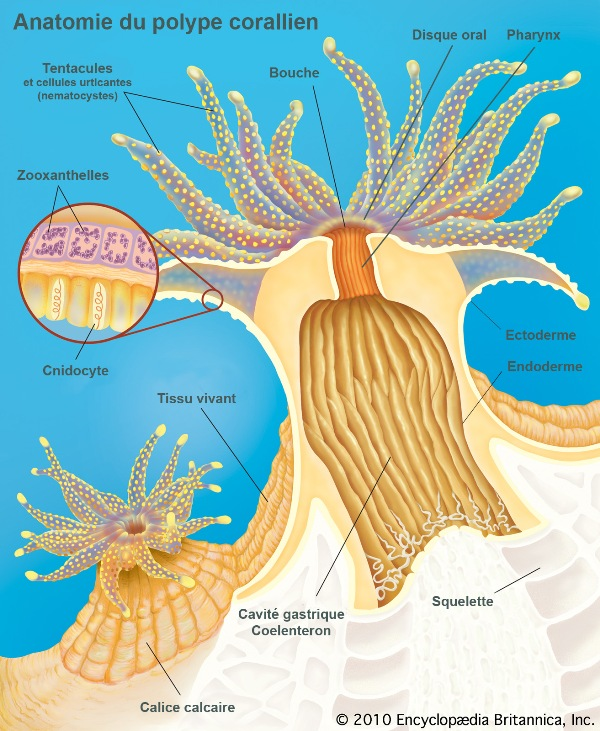
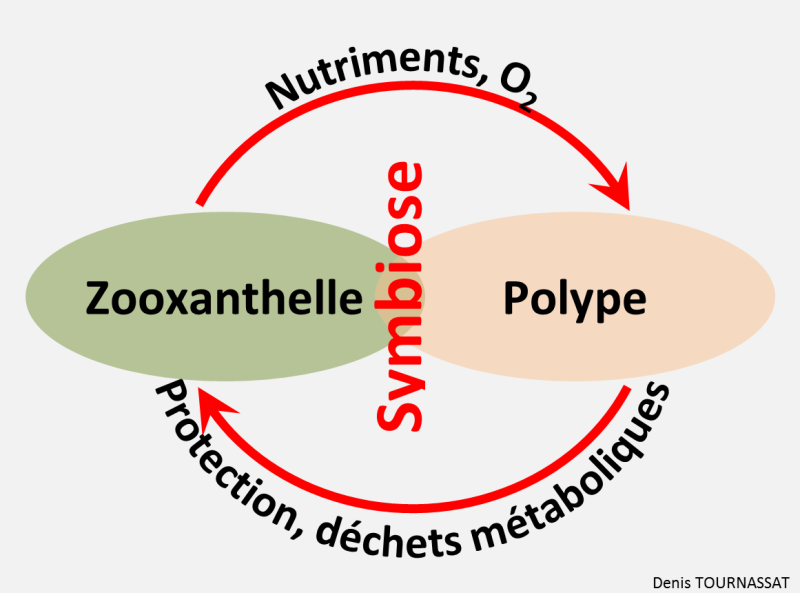
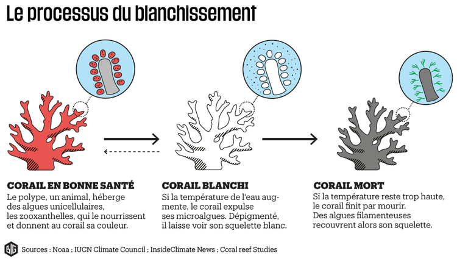

---
output:
  pdf_document:
    latex_engine: xelatex
header-includes: \usepackage {xcolor}
---

# Introduction

Les coraux sont des animaux de l’embranchement des cnidaires, tout comme les méduses. Les individus sont nommés « polypes » (Fig. 2.1).
Au sein des cnidaires, 1609 espèces de coraux durs (scléractiniaire hermatypique) forment les récifs coralliens (Fig. 2.2). Les coraux durs vivent en symbiose avec une microalgue unicellulaire les zooxanthelles qui fournit l'énergie nécessaire à la formation de leur squelette carbonate de calcium (Fig. 2.3).

{} 

\newpage
\null

Les récifs coralliens fournissent d’importantes niches écologiques à de nombreux animaux qui en sont dépendants.  Il est donc crucial de les protéger.        
En situation de stress le corail, peut expulser ses zooxanthelles, ce qui ne laisse paraître seulement la coloration blanche de son squelette. Ce blanchissement affaiblit considérablement le corail (Fig. 2.4). Divers facteurs peuvent stresser le corail : l’acidité, la salinité, la température, la pollution, etc..

Le service d’écologie numérique des milieux aquatiques étudie en mésocosme les réponses écophysiologiques des coraux à divers stress sur *Seriatopora hystrix* Dana 1846 principalement.

Le précédent stagiaire, Raphaël Conotte a développé une application en local à partir du langage R permettant le monitoring des coraux (Fig. 2.5, Fig. 2.6).

Les objectifs du stage sont multiples. Premièrement, il va falloir apprendre le langage R et ses multiples packages. Deuxièmement, se baser sur le travail de Raphaël pour créer une version améliorée de celui-ci. Dernièrement, une mesure régulière des coraux sera effectuée tout au long du stage. Cela consiste à reproduire des échantillons de corails qui seront ensuite pesé deux à trois fois par semaine, ce travail se fait en parallèle avec la partie informatique.

L'application créée pendant ce stage aura été complètement réécrite et simplifé. Le code de Raphaël étant beaucoup trop complexe pour un débutant dans R.  

\begin{figure}[h!]
\includegraphics[]{../image/raphael1.png}
\caption{Application de Raphaël : onglet Dataset}
\end{figure}

