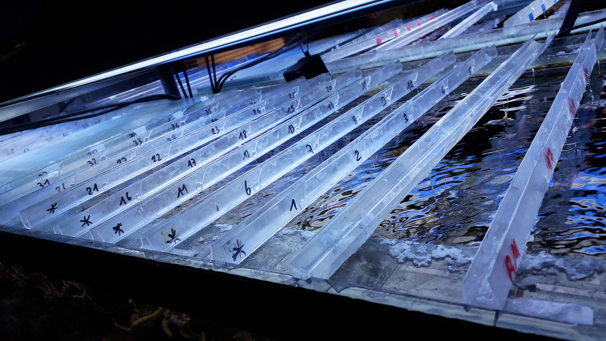
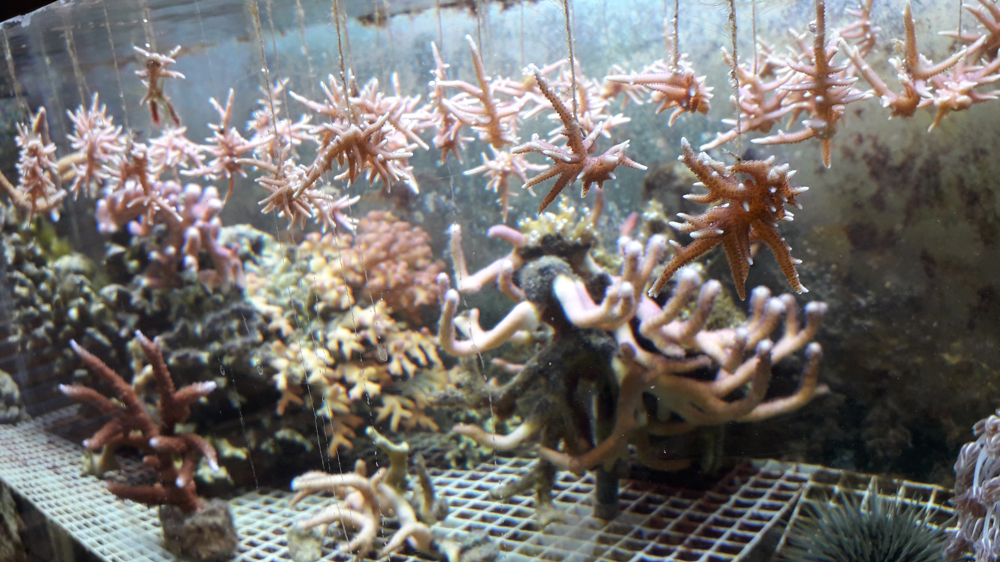

# But

Le but du stage est de créer une application web via le package Shiny dévelopé par RStudio sur R, qui suit l'évolution des coraux dans les mésocosmes. Les coraux seront utilisés dans des expériences par le laboratoire, il est donc nécessaire de visualiser leur croissance.
L'application doit pouvoir être utilisée facilement par d'autres personnes à *posteriori*, il faut donc l'automatiser et anticiper les problèmes à venir.

Le stage se déroule en 2 parties, la première est une phase d'apprentissage, la deuxième est la création de l'application et l'implémentation d'outils pour le monitoring de la croissance des coraux.

## Stage

La phase d'apprentissage comprend :

* Apprentissage du langage de programmation R, de ses packages et de l'environnement RStudio.

La phase de création d'outils comprend :

* L'acquisition des données de croissance régulière des coraux.

* La réalisation d'une application web Shiny, surveillant la croissance (monitoring) des coraux de l'espèce *S. hystrix*.

# Analyse

## Acquisition de données réelles

### Multiplication par bouturage

Dans le but d'acquérir des nouvelles données de croissance, on a utiliser une technique de multiplication asexuée : le bouturage. Cela consiste à séparer à l'aide d'une pince des branches de coraux. Elles sont au nombre de 84, toutes suspendues dans l'eau à l'aide de fil de pêche sur une règle qui porte un numéro d'identification propre à chaque bouture (Fig. ???).

## Outils monitorings

### Masse immergée et masse squelettique
<!-- MASSE -->
Pour évaluer la croissance des boutures de coraux, on utilise la masse squelettique. Pour l'obtenir sans détruire le corail, on mesure la masse immergée du corail dans l'eau de mer avec une balance munie d'un crochet. Cette méthodde de mesure est rapide et peu stressante pour les organismes. Après avoir mesuré la température et la salinité on peut convertir la masse immergée en masse squelettique à l'aide de la formule ci-dessous mise au point par Jokiel *et al* (1978) :

\begin{equation}
\large
  m_{squelettique} = \frac {m_{immerge}}{ \frac{1 - \rho_{eau}}{ \rho_{squelettique}}}
\end{equation}

$\rho_{eau}$ est déterminé via l'équation d'état de l'eau de mer grâce à la mesure de la salinité et de la température.
Le $\rho_{squelettique}$ est la densité de l'aragonite(CaCO3) <!-- # \chemform{CaCO_3} -->du squelette du corail.

### Tableur en ligne

Les mesures effectuées sur les coraux et les paramètres de l'eau des mésocosmes sont dans un premier temps notés dans un cahier de laboratoire puis encodés dans un tableau de données.

Le tableur est en ligne cela permet à n'importe qui, qui a besoin de remplir un tableau de donnée puisse le faire depuis n'importe quelle machine connectée à internet.

Afin d'éviter au maximum des erreurs d'encodages, des règles de mise en forme conditionnelles ont été créé pour mettre en évidence les cases non remplies, formater le type des cellules et mettre un dégradé de couleur suivant l'avancement des données.

Le tableur est divisé en 12 colonnes :

+ project : différencie chaque expérience réalisée, généralement on recréera un nouveau tableur pour chacune des expériences
+ date : date et heure à laquelle les relevés de mesures ont été pris
+ author : nom de la personne ayant encodé dans le tableur
+ aqua : nom du mésocosme où la bouture a été prélevé
+ condition : condition spécifique appliquée à la bouture (exemple : stress hypersalin)
+ species : nom de l'espèce mesurée
+ id : numéro de la bouture mesurée
+ weight : masse immergée mesurée
+ temperature : température de l'eau de mer
+ salinity : salinité de l'eau de mer
+ status : état de santé de la bouture
+ comment : commentaire

\begin{figure}[h!]
\includegraphics[]{../image/tableur-gs.PNG}
\caption{Tableur en ligne Google Sheets}
\end{figure}

### Application Shiny

L'application est divisée en deux éléments, une partie "ui" (User Interface), c'est la partie qui affiche les éléments graphiques de l'interface Shiny à l'utilisateur, et une partie "server", qui contient toutes les commandes R qui s'opère côté serveur.

Il est possible mettre l'intégralité du code dans un seul fichier app.R, mais pour plus de clarté j'ai divisé mon script en deux fichiers ui.R et server.R (voir partie annexe).

Mon application présente 2 onglets, le premier créer un graphique interactif.

\begin{figure}[h!]
\includegraphics[]{../image/notebook-plot1.PNG}
\caption{Application Shiny : onglet "Plot"}
\end{figure}

Par défaut, le graphique utilise en ordonné la masse immergée des boutures et en abscisse la date de la mesure.
Les boutures sélectionnées sont peu nombreuse pour l'exemple mais il est possible de toutes les sélectionner.

Différents paramètres peuvent modifier le graphique.

\begin{figure}[h!]
\includegraphics[]{../image/notebook-plot2.PNG}
\caption{Application Shiny : paramètres}
\end{figure}

On peut sélectionner le taux de croissance en fonction du temps.

<!-- ajouter les formules de calcul du taux de croissance -->

\begin{figure}[h!]
\includegraphics[]{../image/shiny3.PNG}
\caption{Application Shiny : taux de croissance}
\end{figure}

Il est possible de sélectionner les ID dans un menu déroulant ou de directement cliquer à droite du graphique sur les ID triés par couleur. 

Le menu déroulant permet de tout sélectionner ou de tout désélectionner.

\begin{figure}[h!]
\includegraphics[]{../image/shiny4.PNG}
\caption{Application Shiny : menu déroulant}
\end{figure}

\begin{figure}[h!]
\includegraphics[]{../image/shiny5.PNG}
\caption{Application Shiny : affichage intéractif}
\end{figure}

En passant le curseur sur les points du graphique, on peut obtenir quelques informations.

Sous le graphique, des informations supplémentaires : le nombre de boutures mortes, leur ID et le taux de mortalité sont calculés.

<!-- Attention que l'information : ma dernière ligne en va pas vraiment intéressé les utilisateurs de l'app. Est ce que cette info est nécessaire ?  -->

\begin{figure}[h!]
\includegraphics[]{../image/shiny7.PNG}
\caption{Application Shiny : informations supplémentaires}
\end{figure}

Le deuxième onglet contient le tableau de donnée où de nouvelles colonnes ont été calculées, il y a l'ajout de la masse squelettique et du "ratio" qui correspond au taux de croissance.

\begin{figure}[h!]
\includegraphics[]{../image/shiny8.PNG}
\caption{Application Shiny : tableau de donnée}
\end{figure}

## Outils utilisés

Les outils utilisés sont :

* La machine virtuelle *SciViews Box*, contenant un linux (Xubuntu), R, RStudio et les paquets nécessaires pré-installés.

* Les langages de programmation : R.

* Les paquets : Shiny, tidyverse, ggplot2, dyplyr, plotly, googlesheets, ect.

* Le service web GitHub.

## Objectifs réalisés

Les objectifs réalisés sont :

* Bouturer les coraux et relever leurs masses immergées.

* Créer un tableau en ligne contenant les données nécessaires.

* Créer une application web répondant aux besoins du service à l'aide du paquet Shiny.

