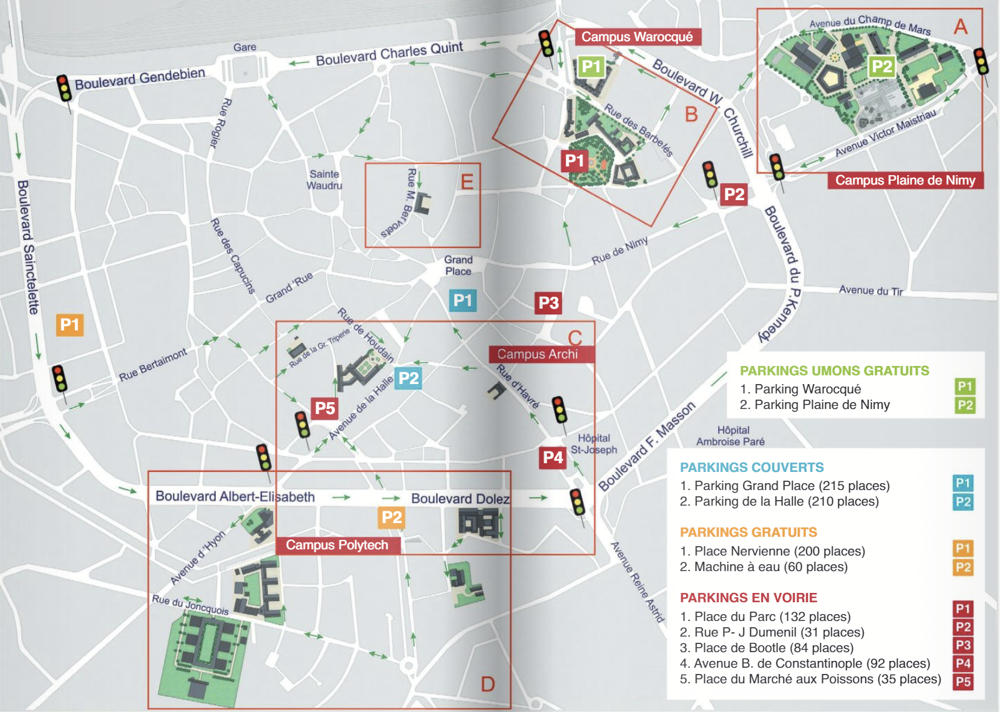
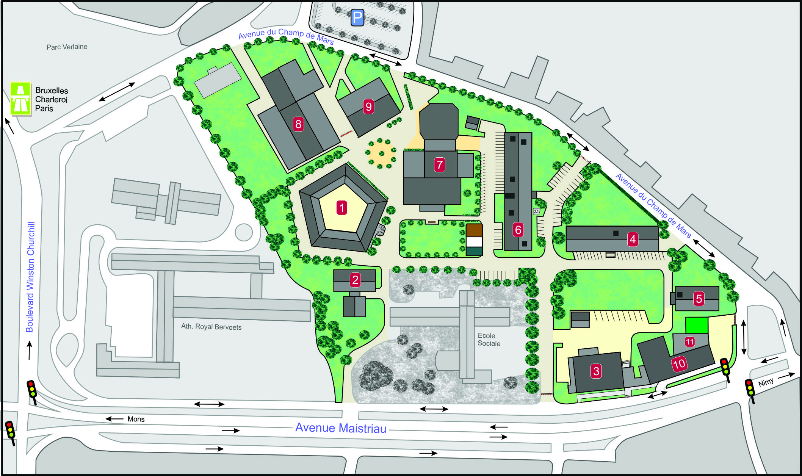
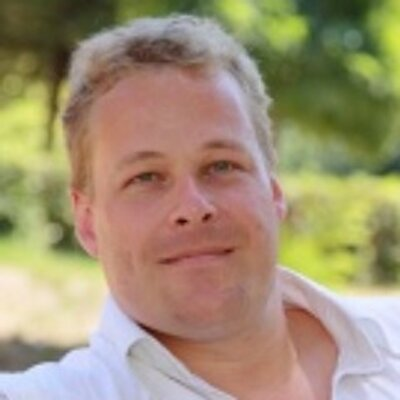
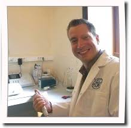
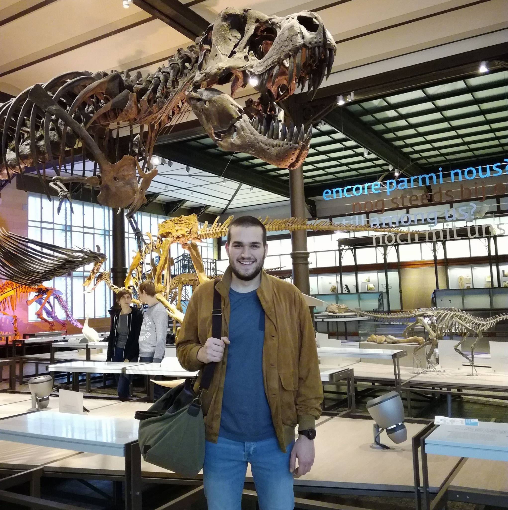
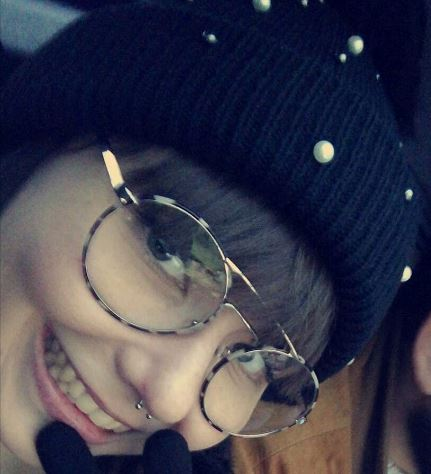

# Présentation

## Présentation de l'entreprise

Mon stage de fin d'études, se déroule dans à l'université de l'UMons dans le service d'Écologie Numérique des Milieux Aquatiques (abrégé en EcoNum) du département de Biologie.

L’Université de Mons (UMONS), est une université francophone implantée en Belgique, dans la province du Hainaut. Elle est constituée de 2 écoles et de 7 facultés, dont la faculté des Sciences.

Le Département de biologie de la faculté des Sciences est impliqué dans la formation des étudiants et dans la recherche.

Le département de biologie de la faculté des Sciences comprend 5 services, dont le service d'Écologie Numérique des Milieux Aquatiques. Ce dernier étudie les écosystèmes aquatiques complexes, tels les communautés planctoniques et les récifs coralliens, face aux changements de leur environnement. 

Le Service développe également des outils en science des données, y compris dans le domaine du data mining, des big data, et de la recherche reproductible. Il participe à des études sur les logiciels Open Source.

Le laboratoire d'EcoNum est situé sur le campus de la plaine de Nimy (A) (Fig. 1.1) dans le pentagone (1) (Fig. 1.2).

## Présentation de l'équipe

### Philippe Grosjean

{width=4cm}
<!-- \begin{figure}[h!] -->
<!-- \includegraphics[width=4cm]{../image/Grosjean2.jpg} -->
<!-- \caption{Monsieur Philippe Grosjean, chef du service d'EcoNum.} -->
<!-- \end{figure} -->

Mon maître de stage est Monsieur Philippe Grosjean. Il mène plusieurs projets de recherches sur l'identification automatique du plancton par des algorithmes de *machine learning*, sur l'écophysiologie des scléractiniaires et sur le développement de logiciel pour l'écologie.

Il enseigne également la science des données biologiques, l'écologie marine, l'écophysiologie et l'océanographie générale aux étudiants en biologie.

Il développe des outils Open Source comme la *SciViews Box*, qui est une machine virtuelle contenant une suite de logiciels préconfiguré pour l'utilisation de ses étudiants et des chercheurs.

Il encadre 1 doctorant et 2 étudiants en masters.

### Guyliann Engels

{width=4cm}
<!-- \begin{figure}[h!] -->
<!-- \includegraphics[width=4cm]{../image/Guyliann.jpg} -->
<!-- \caption{Guyliann Engels, doctorant encadrant le stage.} -->
<!-- \end{figure} -->

Guyliann Engels est chercheur et assistant au sein du service. Il effectue sa thèse sur l'écophysiologie du corail, où il utilise un mésocosme pour étudier les stress des coraux engendrés par la modification de leurs nutriments essentiels (composés azotés et phosphorés). Il utilise fréquemment les outils de statistiques R et RStudio (avec R Markdown, R Notebook).

Il encadre mon travail.

### Antoine Batigny

{width=4cm}
<!-- \begin{figure}[h!] -->
<!-- \includegraphics[width=4cm]{../image/antoine2.jpg} -->
<!-- \caption{Technicien du service d'EcoNum.} -->
<!-- \end{figure} -->

Antoine Batigny est le technicien du service. Il gère principalement les mésocosmes. 

### Rémy Dugauquier
{width=4cm}
<!-- \begin{figure}[h!] -->
<!-- \includegraphics[width=4cm]{../image/remy.jpg} -->
<!-- \caption{Etudiant en master} -->
<!-- \end{figure} -->

Rémy Dugauquier est en dernière année du master en biologie des organismes et écologie. Il réalise son T.F.E. sur l'écologie des organismes planctoniques en baie de Calvi, France. 

### Madeleine Gille
{width=4cm}
<!-- \begin{figure}[h!] -->
<!-- \includegraphics[width=4cm]{../image/madeleine.jpg} -->
<!-- \caption{Etudiante en master} -->
<!-- \end{figure} -->

Madeleine Gille est étudiante en dernière année du master en biologie des organismes et écologie. Elle réalise son T.F.E. sur les effets d'un stress salins (hyper et hyposalin) sur *Seriatopora hystrix* (Dana, 1815). 
