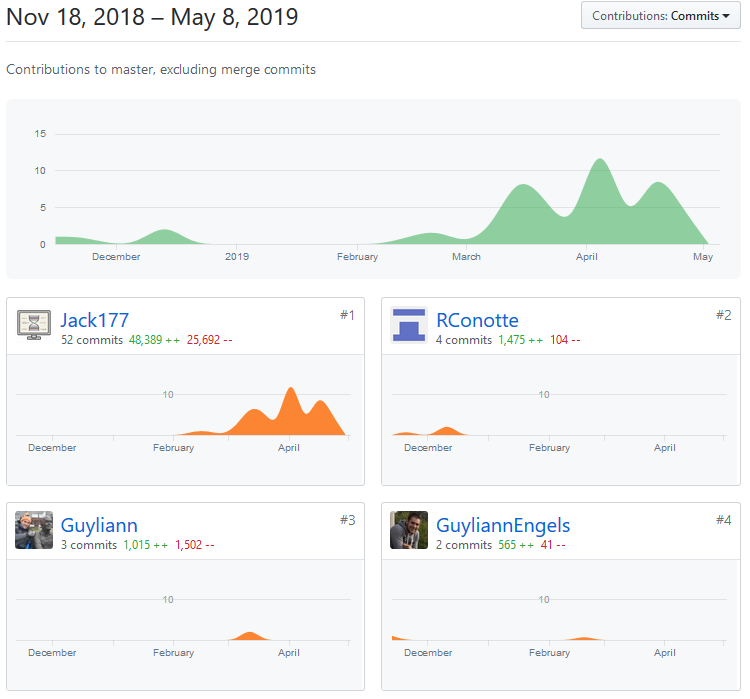

# Résultats et interprétations

## Acquisition de données 

### Multiplication par bouturage

Dans le but d'acquérir de nouvelles données de croissance, on a utilisé une technique de multiplication asexuée : le bouturage. Cela consiste à séparer à l'aide d'une pince des branches de coraux. Le nombre de boutures s'élève à 84, toutes suspendu dans l'eau à l'aide de fil de pêche sur une règle qui porte un numéro d'identification propre à chacune (Fig. 4.1, Fig. 4.2).

\begin{figure}[h!]
\includegraphics[]{../image/regle.jpg}
\caption{Règle numérotée}
\end{figure}

\begin{figure}[h!]
\includegraphics[]{../image/boutures.jpg}
\caption{Boutures suspendues de *Seriatopora hystrix*}
\end{figure}

## Outils monitorings

### Masse immergée et masse squelettique
<!-- MASSE -->
Pour évaluer la croissance des boutures de coraux, on utilise la masse squelettique. Pour l'obtenir sans détruire le corail, on mesure la masse immergée du corail dans l'eau de mer avec une balance munie d'un crochet (Fig. 4.3). Cette méthode de mesure est rapide et peu stressante pour les organismes. Après avoir mesuré la température et la salinité, on peut convertir la masse immergée en masse squelettique à l'aide de la formule ci-dessous mise au point par Jokiel *et al* (1978) :

\begin{equation}
\large
  m_{squelettique} = \frac {m_{immerge}}{ 1 - \frac{\rho_{eau}}{ \rho_{squelettique}}}
\end{equation}

$\rho_{eau}$ est déterminé par l'équation d'état de l'eau de mer grâce à la mesure de la salinité et de la température.
Le $\rho_{squelettique}$ est la densité de l'aragonite (CaCO~3~) du squelette du corail.

\begin{centering}
\begin{figure}[h!]
\includegraphics[angle=270]{../image/poster-balance.jpg}
\caption{Mesure du poids immergé d'une bouture}
\end{figure}
\end {centering}

### Tableur en ligne

Les mesures effectuées sur les coraux et les paramètres de l'eau des mésocosmes sont dans un premier temps notés dans un cahier de laboratoire. Il sera nécessaire de créer un nouveau tableau de donnée afin d'utiliser les données. 

Au début, le tableur choisi était Excel, car c'est le logiciel le plus connu et que la HEH me permet d'utiliser une licence. Cela fonctionnait bien avec les fichiers en local. Malheureusement, aucun package ne permet d'utiliser Excel en ligne.

C'est avec Googlesheets qu'une solution fut trouvée.

Le tableur est en ligne cela permet à n'importe quelle personne de manipuler le tableau de données depuis n'importe quelle machine connectée à internet.

Afin d'éviter au maximum des erreurs d'encodages, des règles de mise en forme conditionnelles ont été créées pour mettre en évidence les cases non remplies, formater le type des cellules et mettre un dégradé de couleur suivant l'avancement des données (Fig. 4.4).

\begin{figure}[h!]
\includegraphics[]{../image/tableur-gs.PNG}
\caption{Tableur en ligne Google Sheets}
\end{figure}

Le tableur est divisé en 12 colonnes :

+ project : différencie chaque expérience réalisée, généralement on préfèrera recréer un nouveau tableur pour chacune des expériences
+ date : date et heure à laquelle les relevés de mesures ont été pris
+ author : nom de la personne ayant encodé dans le tableur
+ aqua : nom du mésocosme où la bouture a été prélevé
+ condition : condition spécifique appliquée à la bouture (exemple : stress hypersalin)
+ species : nom de l'espèce mesurée
+ id : numéro de la bouture mesurée
+ weight : masse immergée mesurée
+ temperature : température de l'eau de mer
+ salinity : salinité de l'eau de mer
+ status : état de santé de la bouture
+ comment : commentaire

## Présentation de l'application Shiny

L'application est divisée en deux fichiers, une partie "ui" (User Interface), c'est la partie qui affiche les éléments graphiques de l'interface Shiny à l'utilisateur et une partie "server", qui contient toutes les commandes R qui s'opère côté serveur.

Il est possible mettre l'intégralité du code dans un seul fichier app.R. Cependant, j'ai divisé mon script en deux fichiers ui.R et server.R pour plus de clarté (voir partie annexe).

\vspace{1 cm}

Mon application présente 3 onglets, le premier créer un graphique interactif (Fig. 4.5).

\begin{figure}[h!]
\includegraphics[]{../image/notebook-plot1.PNG}
\caption{Application Shiny : onglet "Plot"}
\end{figure}

\vspace{0.5 cm}

Par défaut, le graphique utilise en ordonnée la masse immergée des boutures et en abscisse la date de la mesure.
Les boutures sélectionnées sont peu nombreuses pour l'exemple, mais il est possible de toutes les sélectionner.

\vspace{0.5 cm}

Différents paramètres peuvent modifier le graphique (Fig. 4.6).

<!-- \begin{figure}[h!] -->
<!-- \includegraphics[width=10cm]{} -->
<!-- \caption{Application Shiny : paramètres} -->
<!-- \end{figure} -->

{width=15cm}

\vspace{0.5cm}

En ordonnée, on peut choisir :

+ la masse immergée
+ la masse squelettique
+ le taux de croissance (Fig. 4.7)
<!-- ajouter les formules de calcul du taux de croissance -->

\begin{figure}[h!]
\includegraphics[]{../image/taux-croissance.PNG}
\caption{Application Shiny : taux de croissance}
\end{figure}

En abscisse, on peut choisir :

+ la date de la mesure
+ le nombre de jours écoulés depuis la première mesure

Il est également possible de restreindre la période de temps (option *Date range input*).

Il est aussi possible de sélectionner les ID dans un menu déroulant, on peut également désélectionner les lignes en cliquant sur le numéro associer à la couleur de l'ID à droite de l'écran (Fig. 4.8, Fig. 4.9). 

La fenêtre du menu déroulant a maintenant une taille adaptée et ne dépasse pas du cadre. Il permet de sélectionner ou de désélectionner toutes les boutures en deux cliques ou de sélectionner/désélectionner les boutures unes à unes. 

\begin{figure}[h!]
\includegraphics[]{../image/menu-deroulant.PNG}
\caption{Application Shiny : menu déroulant}
\end{figure}

En passant le curseur sur les points du graphique, on peut obtenir quelques informations supplémentaires (Fig. 4.10).

\begin{figure}[h!]
\includegraphics[]{../image/shiny-selection.PNG}
\caption{Application Shiny : affichage intéractif}
\end{figure}

\begin{figure}[h!]
\includegraphics[]{../image/info-curseur.PNG}
\caption{Application Shiny : information via le curseur}
\end{figure}

En bas du graphique, des informations supplémentaires sont données (Fig. 4.11) :

+ Yvar :  l'ordonnée du graphique
+ Species : l'espèce des boutures 
+ Number of deads cuttings : le nombre de boutures mortes
+ ID dead cuttings : l'ID des boutures mortes
+ Death rate : le taux de mortalité

\begin{figure}[h!]
\includegraphics[]{../image/verbatim.PNG}
\caption{Application Shiny : informations supplémentaires}
\end{figure}

Le deuxième onglet contient le tableau de donnée où de nouvelles colonnes ont été calculées, il y a l'ajout de la masse squelettique et du "ratio" qui correspond au taux de croissance (Fig. 4.12).

\begin{figure}[h!]
\includegraphics[]{../image/notebook-table1.png}
\caption{Application Shiny : tableau de donnée}
\end{figure}

Le dernier onglet contient une page d'aide (Fig. 4.13). Cette documentation permettra aux utilisateurs de comprendre comment utiliser l'application et permettra aussi de comprendre comment fonctionne le code. Il est important de documenter son travail si l'on veut qu'il puisse être réutilisé par la suite.

\begin{figure}[h!]
\includegraphics[]{../image/aide.PNG}
\caption{Application Shiny : onglet aide}
\end{figure}

## Difficultés rencontrées

### R vs python

La principale difficulté rencontrée au début est de passer de l'apprentissage du langage de programmation *python* à *R*. Ce sont tous les deux des langages de programmation interprétés qui peuvent être utilisés dans le domaine du traitement de donnée et de création d'application web.
*python* a été créé pour faire de la programmation informatique généraliste, il est utilisé dans de larges domaines par des informaticiens. A l'inverse, R est dédié aux analyses statistiques, plutôt utilisées par des spécialistes ou des scientifiques.

Dans le domaine du *data scientist*, *R* et *python* sont couramment employé.

### Shiny communication entre ui.R et server.R

Les applications web gérées par shiny utilisent deux fonctions communiquant entre elles **ui** et le **server**.

Le schéma de communication basique entre les deux scripts commence par la déclaration d'une variable *inputId = ma_variable* dans ui.R.
Celui-ci est appelé dans server.R sous la forme *input$ma_variable*, cette variable sera ensuite traitée dans un bloc de code délimiter par des crochets.

Shiny utilise du Javascript pour dynamiser l'interface de l'utilisateur sous une couche de code masqué, cette couche simplifie grandement le travail avec R.
Si on sort du cadre de l'utilisation prévu par Shiny, on se heurte à de grands soucis de codage. Shiny restreint donc, la communication entre les différents blocs de code.
Dans certaines situations cela complique le travail, ce fut notamment le cas lors de la création du menu déroulant qui a besoin de connaître dans ui.R le nombre d'ID qui est nécessaire, sauf que la variable donnant cette information est dans server.R et Shiny permet difficilement de faire cela.

## Objectifs réalisés

Les objectifs réalisés sont :

* Apprendre les bases du langage R et différents packages R.

* Maîtriser l'outil RStudio.

* Bouturer les coraux et relever leurs masses immergées.

* Créer un tableau de données en ligne contenant les données nécessaires.

* Créer une application web exploitant en continue les données du tableau en ligne.

* Réaliser un code simple et documenté.

* Utiliser le service web Github afin de réaliser un travail professionnel.

L'outil insight de Github permet de visualiser le travail des différents contributeurs sur un même projet.
On peut constater le travail réalisé pendant le stage (Fig. 4.14). 

# Conclusion 

Le point de départ de ce stage est l'application précédente effectuée par Raphaël Conotte. Pour comprendre son travail, il a fallu dans un premier temps apprendre le langage de programmation R et ses composants. Deuxièmement, il a fallu lire et comprendre son code ainsi que le jeu de données qu'il a utilisé. Dans le même temps, j'ai appris à multiplier du corail, les peser et créer mon propre jeu de données.

On m'a donné la possibilité de soit repartir du code précédent, soit de tout réécrire. C'est le second choix que j'ai pris, car le code de Raphaël étant encore aujourd'hui toujours trop complexe à mes yeux, je pense qu'il a voulu tester différentes manières de faire.

Le début de mon code était donc un fichier vide que j'ai rempli au fur et à mesure, en m'inspirant parfois du code de Raphaël. Je pense avoir rendu un code beaucoup plus simple à lire et mieux documenté. L'application que j'ai réalisée se démarque de celle de Raphaël. En plus de trier la base de données par projet, elle permet également de combiner les tris par condition et par l'état des boutures. 

Contrairement à l'application précédente qui ne contenait que 6 boutures, mon travail en compte 84. Dans le but de faciliter la sélection de celles-ci, le menu déroulant a été perfectionné. 

Le tableau de données présenté dans l'onglet "Data table" a été simplifié, mais il permet de faire un tri sur chacune des colonnes à l'aide d'un curseur de déplacement "slider".

L'application est actuellement en ligne et est disponible à l'adresse suivante : https://jack177.shinyapps.io/coralgrowth/

Une documentation au format *bookdown* a été écrite pour les utilisateurs du laboratoire, mais aussi pour l'informaticien qui souhaiterait améliorer le code. En effet, le travail peut-être amélioré. On pourrait ajouter plusieurs jeux de données à partir d'une url, ajouter des visualisations différentes afin de permettre un autre point vue sur le jeu de donnés ou encore de placer mon code dans un package afin d'être utilisé par n'importe qui utilisant R.

Le dernier onglet "Help" contient la documentation bookdown et le dépôt Github où se trouve la dernière version du code utilisée.

Il est également possible de scanner le *QR code* (Fig. 4.15) qui redirige vers l'application.

\begin{figure}[h!]
\begin{centering}
\includegraphics[width=5cm]{../image/QRcode.png}
\caption{QR code}
\end{centering}
\end{figure}

D'un point de vue personnel, ce stage m'a permis de m'insérer dans une petite équipe où je me suis rapidement intégré. J'ai pu fréquenter un laboratoire de recherche et en apprendre beaucoup sur la vie marine et le milieu universitaire.

Le travail que j'ai effectué était passionnant. Je me suis rendu compte des différentes possibilités que peut offrir l'informatique à la biologie ainsi que la valeur ajoutée que j'ai pu proposer.

J'ai travaillé comme un professionnel sur un projet que j'ai vu se réaliser petit à petit, en utilisant des outils propres aux informaticiens comme Github. J'ai acquis des connaissances sur le traitement de données, découvert le langage de programmation *R* et appris a rédiger en *LaTeX*/*R Markdown* ce rapport.

Je souhaiterai poursuivre das cette voie en apprenant à traiter des données avec *python* à l'aide des paquets *Numpy* et *Pandas* afin de le comparer à R et également apprendre le langage *javascript* utilisé par le package *shiny* qui rend les pages web dynamiques.

